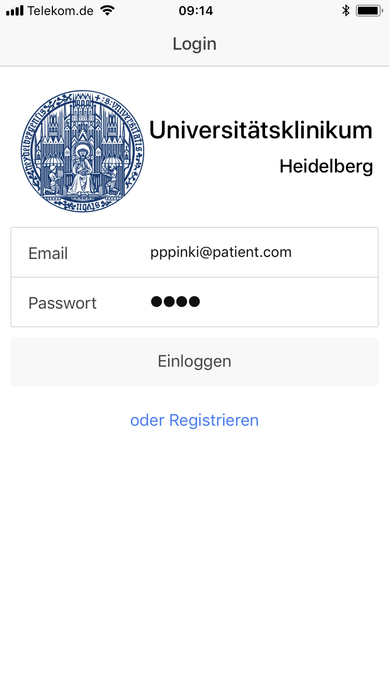
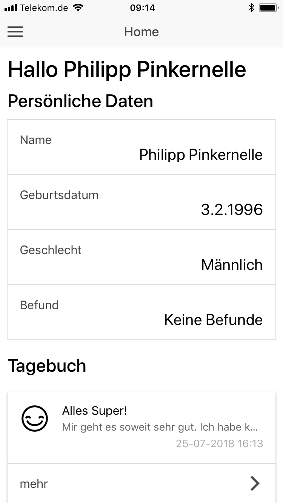
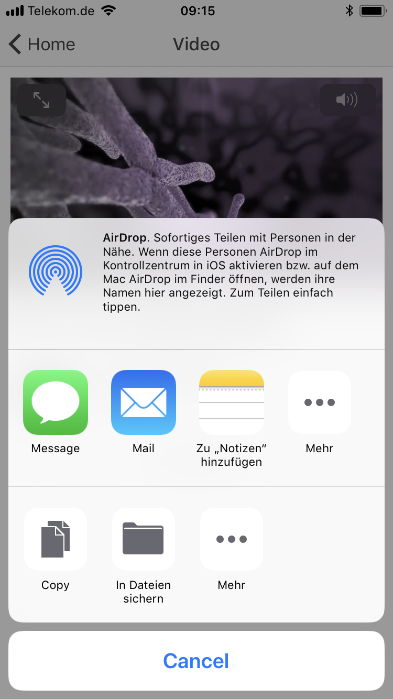
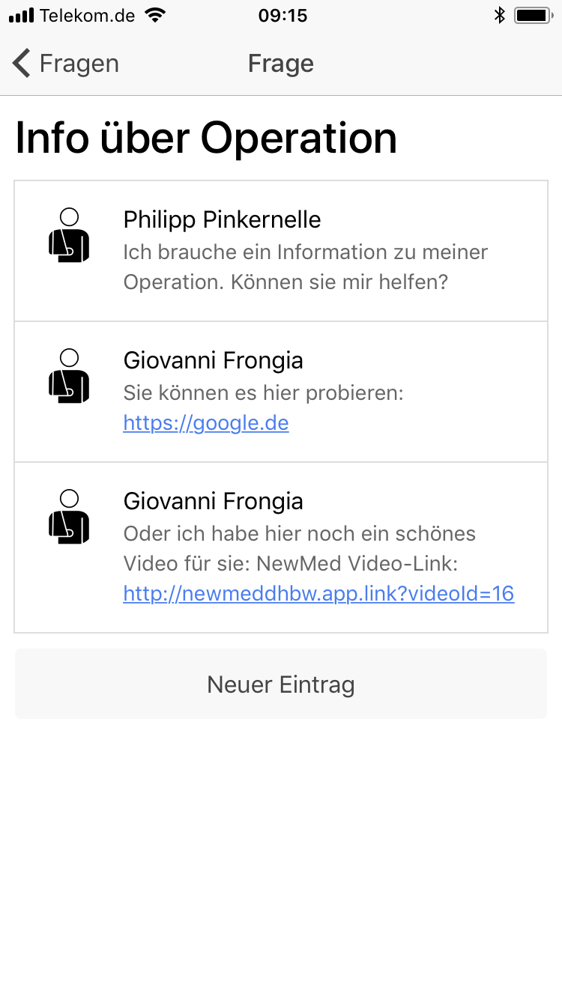
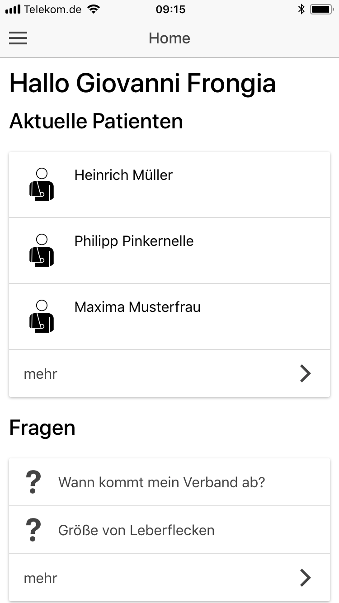

# NewMed - Frontend

Die Applikation wurde mit **Cordova** entwickelt. Dieses Framework zur Entwicklung hybrider Mobilanwednungen stellt eine plattformübergreifende Funktionalität sicher. Als grafische Oberfläche verwenden wir **Ionic** (Version 1).

## Bilder
Hier sind ein paar Screenshots der App zu sehen:

## Installation 

Damit die App getestet werden kann, müssen folgende Pakete installiert sein:
-   Ionic (`npm install -g ionic`)
-   Cordova (`npm install -g cordova`)
-   iOS-Deploy (`npm install -g ios-deploy`) (mögliche Installationsprobleme: <a href="https://github.com/ios-control/ios-deploy/issues/346">Github-Issue</a>, nur für Deployment auf echtem iOS-Device notwendig)
-    Bower (`npm install -g bower`)

## Inhalt

## Lizenz

Copyright [2018] [Steven Dal Pra, Anne Hänzka, Philipp Pinkernelle & Philipp Reichel]

Licensed under the Apache License, Version 2.0 (the "License");
you may not use this file except in compliance with the License.
You may obtain a copy of the License at

    http://www.apache.org/licenses/LICENSE-2.0

Unless required by applicable law or agreed to in writing, software
distributed under the License is distributed on an "AS IS" BASIS,
WITHOUT WARRANTIES OR CONDITIONS OF ANY KIND, either express or implied.
See the License for the specific language governing permissions and
limitations under the License.